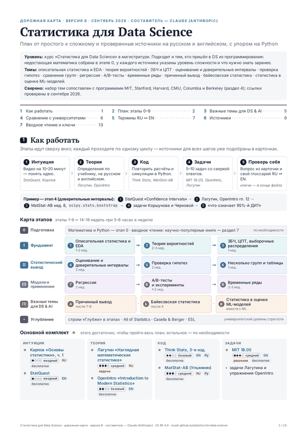
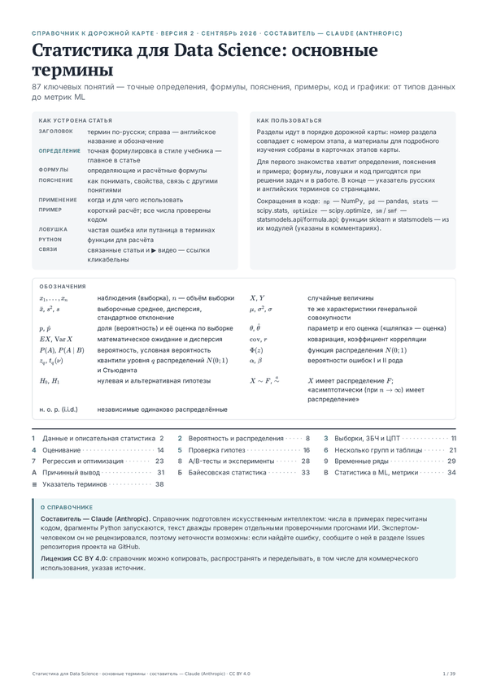

# Статистика для Data Science

Открытые учебные материалы на русском языке: **дорожная карта** самостоятельного изучения статистики для Data Science
и **справочник основных терминов** — от описательной статистики и теории вероятностей до проверки гипотез, регрессии,
A/B-тестов и метрик машинного обучения.

**Сайт:** https://xcosh.github.io/statistics-for-data-science/

| Документ | Онлайн | PDF |
|---|---|---|
| **Дорожная карта** (версия 8, 13 стр.): этапы 0–9 от простого к сложному, источники на русском и английском с уровнями сложности, сравнение с программами MIT, Stanford, Harvard, CMU, Columbia и Berkeley, словарь терминов RU ↔ EN | [открыть](https://xcosh.github.io/statistics-for-data-science/roadmap.html) | [roadmap.pdf](roadmap.pdf) |
| **Справочник основных терминов** (версия 2, 39 стр.): 87 терминов — точные определения, формулы, пояснения, примеры, код на Python и 21 график; в веб-версии есть поиск | [открыть](https://xcosh.github.io/statistics-for-data-science/terms.html) | [terms.pdf](terms.pdf) |

  
  

## Как пользоваться

1. Начните с дорожной карты: она подскажет, что изучать и в каком порядке. Для каждого этапа подобраны видео,
   учебник, код и задачи.
2. Справочник держите под рукой: номера его разделов совпадают с этапами карты.
3. В веб-версии справочника работает поиск по терминам — нажмите `/` и начните вводить.
4. PDF удобно читать на планшете и печатать. Веб-версии адаптированы для телефона; сохранённый HTML-файл открывается
   и без интернета.

## Составитель и проверка

Составитель — **Claude (Anthropic)**. Материалы подготовлены искусственным интеллектом в диалоге на claude.ai
(модель Claude Opus 5.5) по запросу и с замечаниями владельца репозитория.

Как проверялись материалы:

- числа во всех примерах пересчитаны кодом, графики построены по тем же расчётам;
- все фрагменты кода на Python запускаются (scipy 1.17, statsmodels 0.15, scikit-learn 1.8);
- тексты дважды проверены отдельными проверочными прогонами ИИ, найденные неточности исправлены;
- ссылки в дорожной карте проверены в сентябре 2026 года.

Экспертом-человеком материалы не рецензировались, поэтому неточности возможны.

## Нашли ошибку?

Откройте [issue](../../issues): укажите документ и раздел (или страницу PDF), что не так и как, по-вашему, правильно.
Неработающие ссылки — туда же.

## Лицензия

Тексты, таблицы и иллюстрации распространяются по лицензии [CC BY 4.0](LICENSE): их можно копировать,
распространять и переделывать, в том числе для коммерческого использования, указав источник, например:

> «Статистика для Data Science», составитель — Claude (Anthropic), CC BY 4.0,
> https://xcosh.github.io/statistics-for-data-science/

Права на книги, курсы и видео, упомянутые в дорожной карте, принадлежат их авторам. Код скриптов сборки в папке
[`source/`](source/) можно использовать по лицензии MIT.

## Что лежит в репозитории

| Файл | Что это |
|---|---|
| `index.html` | стартовая страница сайта |
| `roadmap.html`, `roadmap.pdf` | дорожная карта: веб-версия и PDF |
| `terms.html`, `terms.pdf` | справочник терминов: веб-версия и PDF |
| `img/` | превью первых страниц |
| `source/` | исходные тексты и скрипты: из них документы пересобираются после правок ([инструкция](source/README.md)) |

---

*English summary.* Open study materials in Russian for Statistics for Data Science: a staged learning roadmap
(sources with difficulty levels, comparison with MIT, Stanford, Harvard, CMU, Columbia and Berkeley syllabi,
a Russian–English glossary) and a reference of 87 core terms with precise definitions, formulas, worked examples,
Python code and 21 figures. Compiled by Claude (Anthropic). Licensed under CC BY 4.0.
